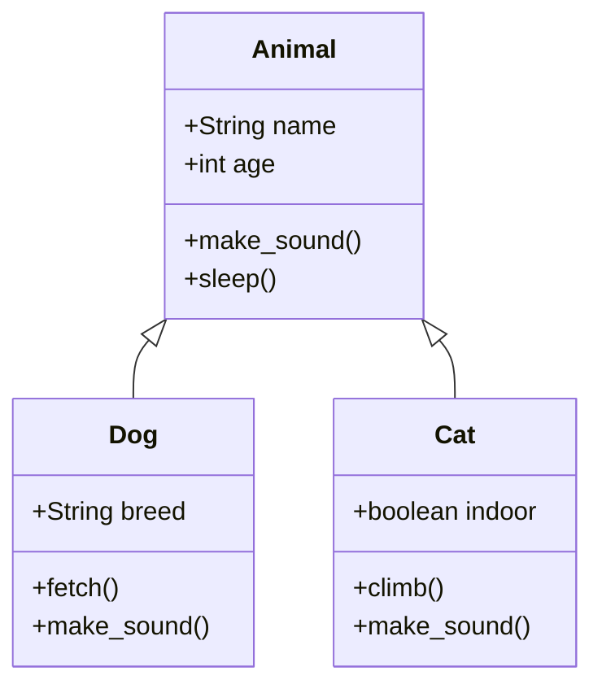

import Accordion from '../../components/Accordion.astro';
import FlipCard from '../../components/FlipCard.astro';
import MCQQuiz from '../../components/MCQQuiz.astro';
import PyRunner from '../../components/PyRunner.astro';
import DeskCheck from '../../components/DeskCheck.astro';
import Callout from '../../components/Callout.astro';

## Overview

Object-Oriented Programming (OOP) revolutionizes how we think about and organize code. Instead of writing long, procedural scripts, OOP lets us model real-world entities as objects with properties and behaviors. A `Student` object might have attributes like `name` and `grade`, and methods like `study()` and `take_exam()`.

This approach makes code more intuitive, reusable, and maintainable. When you understand that a `Car` object can have methods like `start_engine()` and `accelerate()`, you're thinking like a professional developer. OOP principles like inheritance and polymorphism enable you to build complex systems from simple, well-defined building blocks.

In Year 11 Software Engineering, mastering OOP concepts prepares you for advanced software architecture, design patterns, and industry-standard development practices. It's the foundation for frameworks, libraries, and large-scale applications.

<Accordion title="Key Points" id="key-points">

<div class="key-point">
  <span class="key-point-icon">✅</span>
  <div class="key-point-text">
    **Classes and Objects**: Classes are blueprints; objects are instances. Understand the difference between defining a class and creating an object from that class.
  </div>
</div>

<div class="key-point">
  <span class="key-point-icon">✅</span>
  <div class="key-point-text">
    **Encapsulation**: Bundle data (attributes) and methods together. Use private attributes (_attribute) to control access and maintain data integrity.
  </div>
</div>

<div class="key-point">
  <span class="key-point-icon">✅</span>
  <div class="key-point-text">
    **Inheritance**: Child classes inherit from parent classes. Use `super()` to call parent methods and avoid code duplication.
  </div>
</div>

<div class="key-point">
  <span class="key-point-icon">✅</span>
  <div class="key-point-text">
    **Polymorphism**: Different objects can respond to the same method call in their own way. A `Dog` and `Cat` can both have a `make_sound()` method.
  </div>
</div>

<div class="key-point">
  <span class="key-point-icon">⚠️</span>
  <div class="key-point-text">
    **Constructor (`__init__`)**: Always initialize your objects properly. Forget `self` parameter and watch for uninitialized attributes.
  </div>
</div>

<div class="key-point">
  <span class="key-point-icon">✅</span>
  <div class="key-point-text">
    **Method vs Function**: Methods belong to classes and take `self` as first parameter. Functions are standalone.
  </div>
</div>

<div class="key-point">
  <span class="key-point-icon">✅</span>
  <div class="key-point-text">
    **UML Class Diagrams**: Visualize relationships between classes using standard notation for attributes, methods, and inheritance.
  </div>
</div>

</Accordion>

## Interactive Learning



<FlipCard frontTitle="Inheritance Challenge" id="inheritance-quiz">
  <div slot="front">
    <p><strong>Design Problem:</strong> You have a `Vehicle` class and need to create `Car` and `Bicycle` subclasses.</p>
    <p>What attributes/methods should go in the parent class vs. child classes?</p>
    <p>Think about what's common and what's specific...</p>
  </div>
  <div slot="back">
    <p><strong>Parent Class (Vehicle):</strong></p>
    <ul>
      <li>Common attributes: `brand`, `model`, `year`</li>
      <li>Common methods: `start()`, `stop()`</li>
    </ul>
    <p><strong>Car specific:</strong> `engine_size`, `fuel_type`, `honk()`</p>
    <p><strong>Bicycle specific:</strong> `gear_count`, `frame_material`, `ring_bell()`</p>
    <p>Rule: Put shared features in parent, unique features in children!</p>
  </div>
</FlipCard>

<PyRunner 
  title="Explore OOP Concepts"
  code={`class Student:
    def __init__(self, name, student_id):
        self.name = name
        self.student_id = student_id
        self._grades = []  # Private attribute
        
    def add_grade(self, grade):
        if 0 <= grade <= 100:
            self._grades.append(grade)
        else:
            print("Invalid grade!")
    
    def get_average(self):
        if self._grades:
            return sum(self._grades) / len(self._grades)
        return 0
    
    def __str__(self):
        return f"Student: {self.name} (ID: {self.student_id})"

# Create objects and test
alice = Student("Alice Johnson", "S001")
bob = Student("Bob Smith", "S002")

alice.add_grade(85)
alice.add_grade(92)
alice.add_grade(78)

print(alice)
print(f"Alice's average: {alice.get_average():.1f}")

# Try to access private attribute
print(f"Alice's grades: {alice._grades}")  # Works but not recommended`}
/>

<DeskCheck
  title="Object Creation Desk Check"
  variables={["student1.name", "student1._grades", "grade", "average"]}
  steps={[
    { line: "1", values: ["", "[]", "", ""] },
    { line: "2", values: ["'Alex'", "[]", "", ""] },
    { line: "3", values: ["'Alex'", "[85]", "85", ""] },
    { line: "4", values: ["'Alex'", "[85, 90]", "90", ""] },
    { line: "5", values: ["'Alex'", "[85, 90]", "90", "87.5"] }
  ]}
>
```python
student1 = Student("Alex", "S123")     # Line 1
# Constructor sets name = "Alex"       # Line 2
student1.add_grade(85)                # Line 3
student1.add_grade(90)                # Line 4
average = student1.get_average()      # Line 5
```
</DeskCheck>

## How to Revise

**1. Draw UML Diagrams**: Practice creating class diagrams for real-world scenarios. Start with simple examples like `Book`, `Library`, and `Member`. Include attributes, methods, and relationships. This visual approach helps you understand class hierarchies.

**2. Code Class Hierarchies**: Create inheritance chains like `Animal → Mammal → Dog` or `Employee → Teacher → Subject Teacher`. Focus on what moves up to parent classes and what stays specific to child classes.

**3. Trace Object Interactions**: Pick two or three objects and trace how they interact through method calls. For example, trace how a `Student` enrolls in a `Course` and how the `Course` updates its enrollment list.

## Practice Questions

<MCQQuiz
  question="What is the main purpose of encapsulation in OOP?"
  options={[
    "To make code run faster",
    "To hide internal details and control access to data",
    "To create multiple instances of a class",
    "To establish parent-child relationships between classes"
  ]}
  correctAnswer={1}
  explanation="Encapsulation bundles data with methods and restricts direct access to some components, promoting data integrity and modularity."
  id="encapsulation-quiz"
/>

**Short Answer Questions:**

1. **Class Design** (4 marks): Design a `BankAccount` class with attributes for account number, balance, and account holder name. Include methods for deposit, withdraw, and get_balance. Show the constructor and one method implementation.

2. **Inheritance** (5 marks): Create a `Shape` parent class with an area() method, then create `Rectangle` and `Circle` child classes that override this method. Include appropriate constructors and attributes for each shape.

3. **Polymorphism** (3 marks): Explain how polymorphism allows a list containing different animal objects (Dog, Cat, Bird) to call make_sound() on each animal, producing different sounds. Include a code example.

<Accordion title="Answers & Marking Hints" id="answers">

**Question 1 Answer (4 marks):**
```python
class BankAccount:
    def __init__(self, account_number, account_holder, initial_balance=0):
        self.account_number = account_number     # 1 mark for constructor
        self.account_holder = account_holder
        self._balance = initial_balance          # 1 mark for attributes
    
    def deposit(self, amount):
        if amount > 0:                          # 1 mark for validation
            self._balance += amount
            return True
        return False
    
    def get_balance(self):                      # 1 mark for getter method
        return self._balance
```

**Question 2 Answer (5 marks):**
```python
import math

class Shape:                                    # 1 mark for parent class
    def area(self):
        raise NotImplementedError("Subclass must implement")

class Rectangle(Shape):                         # 1 mark for inheritance syntax
    def __init__(self, length, width):
        self.length = length
        self.width = width                      # 1 mark for constructor
    
    def area(self):                            # 1 mark for method override
        return self.length * self.width

class Circle(Shape):
    def __init__(self, radius):
        self.radius = radius
    
    def area(self):                            # 1 mark for correct area calculation
        return math.pi * self.radius ** 2
```

**Question 3 Answer (3 marks):**
Polymorphism allows different objects to respond to the same method call in their own way. Each animal class implements `make_sound()` differently:

```python
animals = [Dog("Rex"), Cat("Whiskers"), Bird("Tweety")]  # 1 mark for concept

for animal in animals:                         # 1 mark for demonstration
    animal.make_sound()  # Calls appropriate version

# Output varies by animal type:
# Dog: "Woof!"  Cat: "Meow!"  Bird: "Tweet!"   # 1 mark for explanation
```

</Accordion>

<Callout type="teacher" title="Teacher Notes">

**Classroom Demo Suggestion**: Use physical props to demonstrate OOP concepts. Have students hold cards representing different objects (Student, Teacher, Course). Show inheritance by having "Person" cards that both Students and Teachers extend. Demonstrate encapsulation by having students keep some information "private" and only share it through specific "methods."

**Assessment Strategy**: Focus on students' ability to identify appropriate class hierarchies rather than memorizing syntax. Good OOP design thinking is more valuable than perfect code.

</Callout>